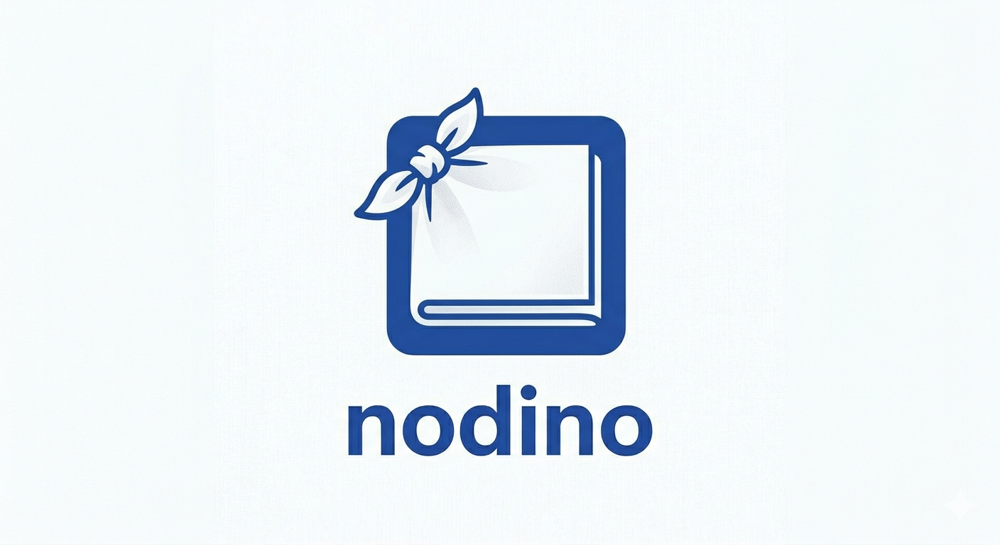

<p align="center">
  
</p>

---

A voice-first second-brain agent that extracts structured knowledge from natural conversation, stores it in a semantic memory palace, and displays it as fading data cards in real time.

You talk (or type), the agent listens. Behind the scenes it creates knots (events, tasks, ideas, observations, ...), discovers entities (people, places, things), and weaves relationships (nodinos) between them. The UI shows only data — no chat transcript, just knowledge flowing in from the bottom and fading out over time. Semantic search lets you retrieve anything by meaning, not just keywords.

## Architecture

| Service | Role |
|---------|------|
| **backend** | Go API server, Anthropic Claude tool-use orchestration |
| **mempalace-api** | Semantic memory store + knowledge graph (REST) |
| **chroma** | ChromaDB vector database (internal to mempalace) |
| **whisper** | Speech-to-text via faster-whisper (medium.en) |
| **piper** | Text-to-speech via Piper TTS |
| **nginx** | Static frontend + HTTPS reverse proxy |

## Quick Start

Create a `.env` file:

```
ANTHROPIC_API_KEY=sk-ant-...
CAL_DAV=https://your-nextcloud.example.com/remote.php/dav
NEXTCLOUD_USER=your_username
NEXTCLOUD_PASSWORD=your_app_password
```

Then run:

```bash
docker compose up --build
```

Open `https://<host>:8890` (self-signed cert) or `http://localhost:8889`.

The Nextcloud calendar variables are optional — the agent works without them but won't have calendar access.

## How It Works

1. Speak into the microphone or type a message
2. Audio is transcribed by Whisper; text is sent to Claude via the Anthropic API
3. Claude uses tools to store knots, search knowledge, manage entities, link relationships, and query/create calendar events — all backed by mempalace's semantic search, knowledge graph, and Nextcloud CalDAV
4. New data cards appear in the center column, agent replies are spoken via Piper TTS
5. Cards age and fade out over time; drag to pin important ones

## Memory Palace

- **Drawers** — verbatim knowledge chunks stored in ChromaDB, searchable by meaning
- **Knowledge Graph** — entities and temporal relationships in SQLite
- **Semantic Search** — find anything by what it means, not just what it says

## Nextcloud Calendar

Nodino integrates with Nextcloud via CalDAV:

- **Query events** — "what's on my calendar this week?"
- **Create events** — "schedule a meeting with Daniel on Friday at 2pm"
- Events appear as appointment cards on screen

## Knowledge Types

event, appointment, reminder, observation, mood, log, anecdote, idea, project, decision, contact, task

## UI Features

- Three-column layout: agent bubbles (left) | data cards (center) | user bubbles (right)
- Voice input via microphone button + text input
- Drag-to-pin cards to prevent fade-out
- Double-click cards to edit inline
- Kanban board for task management
- Todo list view (todo + in-progress only)
- Auto dark/light mode
- TTS playback of agent responses
